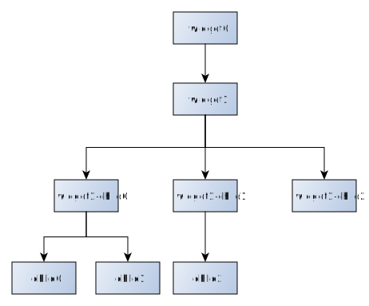
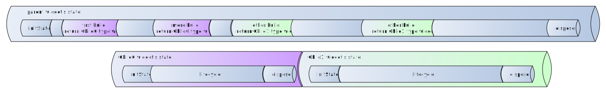
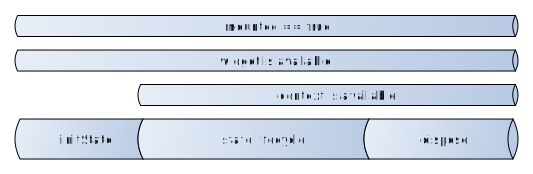

Async Runtime
===========

A framework write in C++11 (compatible with up to C++17 standard) that similar with Flutter but without build GUI. Just for backend software. With object management, software architecture management and async runtime management. 

## 0.2.6-nullsafety

Welcome to nullsafety world! Now framework provide nullsafety feature. [ref](include/async_runtime/basic/ref.h) for non-null refs of object and [option](include/async_runtime/basic/ref.h) for nullable refs of object. 

1) [ref, option and weakref](include/async_runtime/basic/ref.h) for object management (implement base on std::shared_ptr, cross-platform, less buggy and nullsafety)

2) widget and context for software architecture management. (Widget tree layout and lifecycle just similar with Flutter. If you familiar with Flutter, there is nothing new for you to learn)

3) all async apis directly build upon context, init async tasks right after State::initState and dispose async resource when State::dispose (so that async work managed by framework). Ease code and less memory lack problem and less state-unknown conflict problem.

4) compatible with <span style="color:Fuchsia">Windows/Linux/macOS</span> and more. compatible with <span style="color:Fuchsia">C++17/14/11</span>. <span style="color:Fuchsia">CMake</span> build rule. 

## Code

```c++
// StatelessWidget example
class MyWidget : public StatelessWidget {
    ref<Widget> build(ref<BuildContext> context) override 
    {
        // build your child widget without state
        ...
    }
};
```

```c++
// StatefulWidget example
class MyWidget : public StatefulWidget {
    ref<State<>> createState() override;
};

class _MyWidgetState : public State<MyWidget> {
    ref<Widget> build(ref<BuildContext> context) override 
    {
        // build your child widget with state
        ...
    }
};

inline ref<State<>> MyWidget::createState() { return Object::create<_MyWidgetState>(); }
```

```c++
// run your widget as root widget
// framework will automatically unfold the widget tree
runApp(Object::create<MyWidget>());
```

## Widget tree

### Tree layout



<br/>

### Tree lifecycle

* as if both parent and child are StatefulWidget



<br/>


## State lifecycle

* as if the widget is StatefulWidget



<br/>

## Async
This framework provides async task management. All async components showup in [fundamental]() folder. The common async tasks already build in framework. 
<br/>
1) Timer (Callback style async. Also see: Future::delay)
2) File
3) Http

<br/>

Except Timer, all async components take advantage of [Future]() and [Stream]() to implement async. 

If you not satisfy with build-in async api. This framework provides [Completer]() for build [Future]() and [StreamController]() for build [Stream]() to achieve async program. 

<br/>

All async api request one more argument than traditional async programming language. They always request [ref<State<>>]() or [ref\<ThreadPool>](), Because this framework is designed for multi-thread application. Async task must need to know which thread it should return to. For example: 

```c++
class MyState : public State<MyWidget> {
    using super = State<MyWidget>;
    lateref<Timer> _timer;

    void initState() override 
    {
        super::initState();
        _timer = Timer::delay(self() /* timer always request a reference of current State to build a timer object */, 
            Duration(1000), []{ ... });
    }
};
```

## Reference

- test case and demo 
<br/>https://github.com/JohnGu9/async_runtime_test

- system request
<br/>[thread](https://en.cppreference.com/w/cpp/thread/thread) and [openssl](https://www.openssl.org/) support